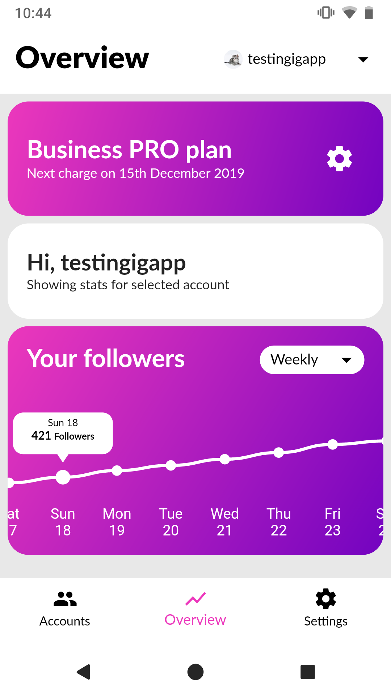
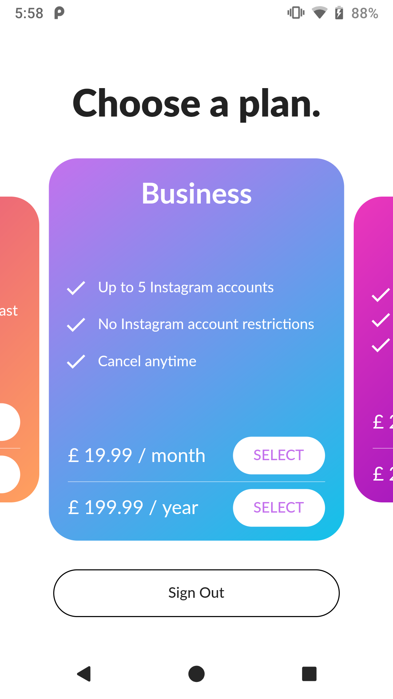
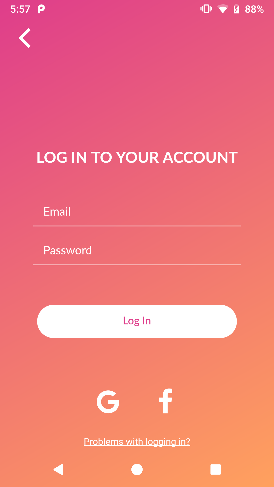
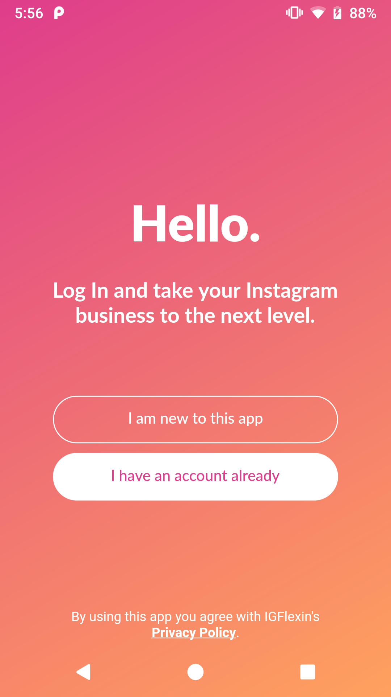

# IGFlexin

My first Flutter app (2018) that I made for a client who wanted to sell an app that would help people gain followers on instagram by repeatedly following and unfollowing popular people. The app would also serve as an follower tracker. The code is a bit archaic and not representative of my current experience. This app also broke terms of service and is not on the app store anymore. However, I am still proud of it as it was my first app and I learned a lot from it so I decided to put it on GitHub.

This version of the app is a Flutter version. The original app was made in Kotlin and is available in the (master)['https://github.com/daviddomkar/igflexin/tree/master'] branch.

I made a stripe flutter plugin back then to handle the subscription system. It is available in the (flutter_stripe_sdk)['https://github.com/daviddomkar/flutter_stripe_sdk'] repository, but it is not maintained anymore.

## Features

- User authentication with Firebase
- Plan selection and subscription system with Stripe and Firebase Cloud Functions
- Addig and removing Instagram accounts
- Following and unfollowing popular Instagram accounts using server side automation
- Tracking followers
- User settings
- Custom router (I wanted to have a custom router that would allow me to do some cool animations but I would not recommend doing this)

## Screenshots

